בס"ד

**TFlower - Flower Recognizer App**

Naama Zecharia, Ruth Afgin & Shlomit Cohen

Supervisor: DR. Galit Haim

# Contents
` `TOC \o "1-3" \h \z \u [1.	Project description	 PAGEREF _Toc49937294 \h 2](#_Toc49937294)

[2.	Related Work	 PAGEREF _Toc49937295 \h 3](#_Toc49937295)

[3.	Functional Description / Requirements	 PAGEREF _Toc49937296 \h 4](#_Toc49937296)

[4.	Work plan	 PAGEREF _Toc49937297 \h 5](#_Toc49937297)

[4.1.	Create Model – using Transfer Learning	 PAGEREF _Toc49937298 \h 6](#_Toc49937298)

[4.2.	Build the App – using Android studio	 PAGEREF _Toc49937299 \h 10](#_Toc49937299)

[5.	Analysis & Conclusion	 PAGEREF _Toc49937300 \h 14](#_Toc49937300)

[6.	Workflow	 PAGEREF _Toc49937301 \h 18](#_Toc49937301)

[7.	Bibliography	 PAGEREF _Toc49937302 \h 19](#_Toc49937302)

1. # **Project description**
We start with a thinking of creating a model. We made some research online and found a great idea of flower recognizer. 

We train a classifier to recognize flowers using Transfer-Learning. Than, we convert the classifier to TFLite and upload it to our Android studio app. 

` `An Android mobile application that’s demonstrates [image classification](https://www.tensorflow.org/lite/models/image_classification/overview) using the device camera. The app is supported by the TensorFlow Lite Android Support Library of Google. 

1. # **Related Work**

The study of flower classification system is a very important subject in the field of Botany. A classifier of flowers with high accuracy will also bring a lot of fun to people's lives. However, because of the complex background of flowers, the similarity between the different species of flowers, and the differences among the same species of flowers, there are still some challenges in the recognition of flower images. The traditional flower classification is mainly based on the three features: color, shape and texture, this classification requires people to select features for classification, and the accuracy is not very high. In this project, based on MobileNet-V2 model of Google, we use the transfer learning technology to retrain the flower category datasets, which can greatly improve the accuracy of flower classification.

We implement the classifier model into an Android app for easy use. Our Classifier support: daisy, dandelion, roses, sunflowers, and tulips – the most popular flowers’ type we selected. 

The app functionality is really easy to user – user friendly - Simply take a photo of the flower and TFlower gives an online results of the top 3 predictions. The results can be share to other via multiple sharing apps like WhatsApp, Gmail, SMS… 

Other apps Like: PlantNet and PictureThis also predict the flower types but a little bit hard to user (too much information and functionality)– The UX (User usability) in TFlower app is much focus on Flower recognizer. 

`                       `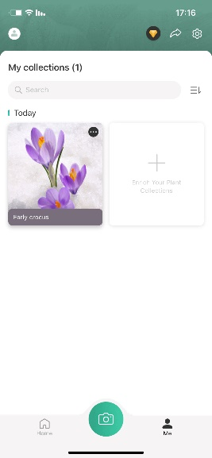                   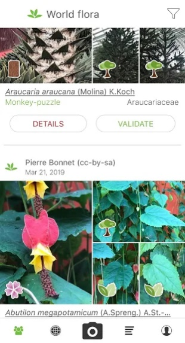

`			`PictureThis			      PlantNet

1. # **Functional Description / Requirements**
The app should open the device’s camera and save the captured image in the main screen.

When the image is saved the image should be send to the classifier to recognize the flower type displaying in the screen.

The app should ask for permission to the device camera 

The model should be support 5 types of Flowers. 

The user should be able to open the camera by one simple click on a button.  

The prediction should be generated online and displayed in a list.

The top 3 prediction should be displayed in a list according to the prediction rate.

Share button should be added and share the predicted results. (added at the end of development)

1. # **Work plan**
After a long research we found accessible technique for classifying images.  

Training from scratch requires a lot of labeled training data and a lot of computing power. So, we decided to use a technique called Transfer Learning where we take a pre-trained network (MobileNet V2 ), use it to extract features, and train a new layer on top for our own task of classifying images of flowers.

The benefits of Transfer Learning: Train a model with a smaller dataset, Improve generalization, and Speed up training.

We found an online notebook “Colab” (Google) – for writing and executing Python in browser. The execution is preformed on Google's cloud servers. 

Another version of TensorFlow is the TensorFlow Lite. TensorFlow Lite is an open source deep learning framework for on-device inference – We decided to use it for converting the model and use it in our application - TFlower.  

The dataset is split into 80% training and 20% validation. We applied transformation in these images - random scaling. This helps the network generalize, lead to better performance. Moreover, the images were resized to 224x224 pixels as required by the pre-trained networks and We set the batch size to 64 to train our data.

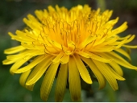Let’s see some examples of flowers we want to predict:

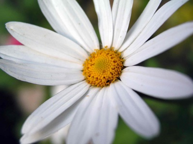 		Rose				 Daisy 				Dandelion 

1. ## ***Create Model – using Transfer Learning***
- First we Download the flowers dataset from google cloud server (<https://storage.googleapis.com/download.tensorflow.org/example_images/flower_photos.tgz>) and Resize all the images to a shape that is acceptable by MobileNet V2  (the base model that we used)
- Then we created the base model from the **MobileNet V2** model developed at Google, and pre-trained on the ImageNet dataset 
  - Add **MobileNet V2** model (as the base model) without the classification layers at the top (ideal for feature extraction - more generic)
  - ` `Freeze the convolutional base and use that as a **feature extractor**
  - Add a classifier on top of it - consists of 4 units with relu, dropout, GlobalAveragePooling2D and softmax 

The model layers:

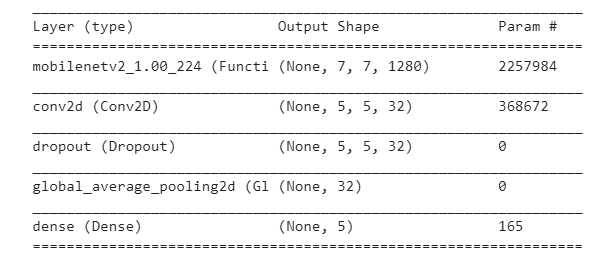

- Compile the model
- Train the model- Use the Adam() optimizers and Since there are multiple classes, we used a categorical cross-entropy loss. The epochs were set to 10. 

- We reach accuracy of 0.8673 and loss of 0.4937 (because this technique does not leverage data augmentation, which is essential to preventing overfitting with small image datasets)

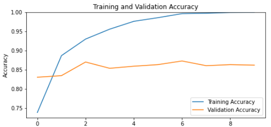

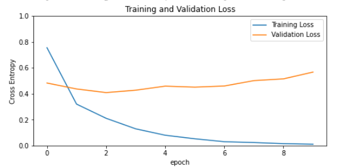

- We tried to increase the performance by **Fine-Tune** technique (Train the weights of the top layers of the pre-trained model alongside the training of the added classifier): 

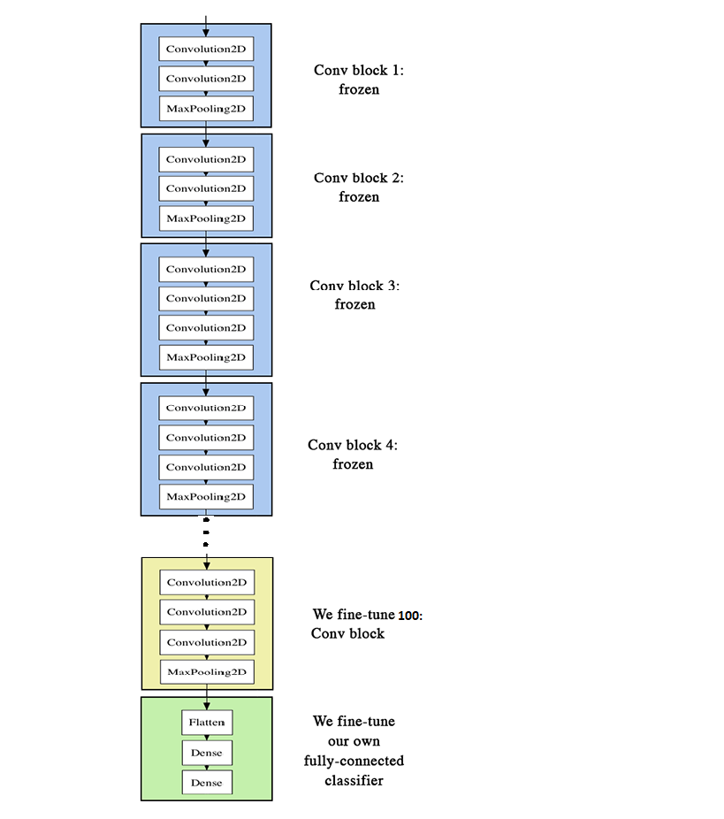

\1. Unfreeze the base model

\2. Freeze all the layers before the `fine\_tune\_at` layer

\3. Compile the model

\4. Train the model – set the epochs to 5.

- We reach accuracy of 0. 8728 and loss of 0.5701 

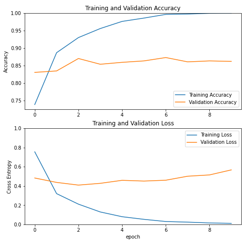

Output of the model prediction:

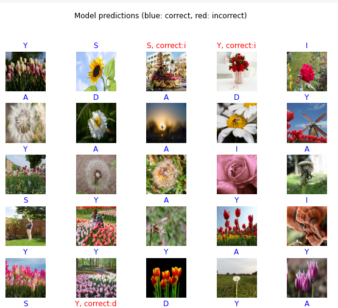

- Convert the Model to TF Lite by TFLiteConverter function.

1. ## ***Build the App – using Android studio***
To create the TFlower app we used “the TensorFlow Lite Android Support Library”.

This library makes it easier to integrate models into the application. It provides high-level APIs that help transform raw input data into the form required by the model, and interpret the model's output.

It supports common data formats for inputs and outputs, including images and arrays. It also provides pre- and post-processing units that perform tasks such as image resizing and cropping.

First,

**Convert the model:**

- we saved the model using tf.saved\_model.save and then convert the saved model to a tf lite compatible format.

**Create Android Studio Project**

**Import Gradle dependency and other settings**

- In the build.gradle file we added TensorFlow Lite to the app's dependencies

- Add the converted model and Labels file to the assets folder:

- and added in the [AndroidManifest.xml](https://github.com/tensorflow/examples/tree/master/lite/examples/image_classification/android/app/src/main/AndroidManifest.xml) to set the camera permission.

**Creating The Tensor Image Classifier**

- Create a class name **ImageClassfier** and configure the variables.

- Create a **constructor** that accepts an **Activity** as an argument. In this constructor we:

\1. load the model from the file into a MappedByteBuffer.

\2. load the labels from the file into a List<String>.

\3. Create a Tensor Interpreter to classify images.

\4. Read the type and the shape of input and output tensors

\5. Create an input TensorImage (Input Tensor)

\6. Create an output tensor and its processor

\7. Create a Post-Processor for the output probabilities.

- Create a method named **loadImage** that accepts a Bitmap and an integer for sensorOrientation. 

This method loads the input bitmap into the input tensor 

Perform pre-processing on the image using an **ImageProcessor**.

Returns the input tensor after preprocessing.

- Create a simple class **Recognition** inside the ImageClassfier to hold the result returned by the classifier. This class implements Comparable so that the predictions made by the model can be sorted based on the confidence.

- Create a method name **recognizeImage** inside the ImageClassifier

This method loads the input bitmap into the input tensor by calling the loadImage method.

The pre-processed image is then used to make predictions.

Returns the top prediction made in the classifier

**Main Activity**

- Create the layout for the **main\_activity**. The main activity contains an image view to display the image captured from the camera, a list view to display all the predictions made by the model ,button to launch camera and a floating button to share the results.

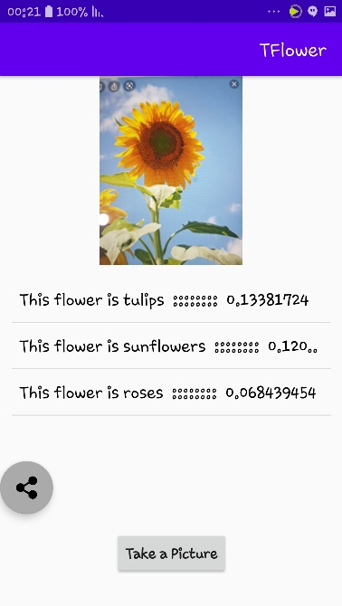

- In the MainActivity.java file create the variables

- Create a method named **initializeUIElements**() to initialize the UI elements and Call this method from the onCreate() of the activity.

In the onClickListener for the Take Picture button, we checked whether camera permissions are available before opening the camera. And In the OnClickLisener for sharing the results, we check if results was generated and share using the shareResults. 

- Add method to manage and request permission in this activity. The permission we are interested in is Manifest.Permission.CAMERA.

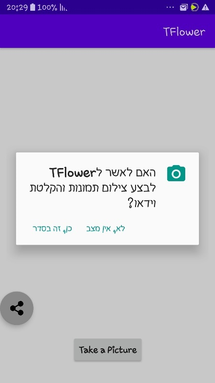

- Add a method named **openCamera()** which will be called if proper permissions has been granted. The method starts an intent to take a picture from the camera.

- Override the method **onActivityResult()** to accept the picture taken from the camera.

\1. The Bitmap obtained from the camera is displayed in the ImageView.

\2. Save the image for future sharing

3.The Bitmap is passed on to the ImageClassifer to get the probabilities by calling the recognizeImage() method.

\4. The probabilities returned by the classifier is displayed in the ListView.

- create the method **shareResults()** which save the bitmap image to cache directory and share the image and results- predictions using Intent ACTION\_SEND

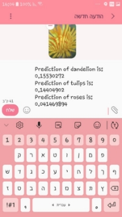

1. # **Analysis & Conclusion**
Testing a different angles and environments of flowers pictures.

|**Input**|**Sunflower**|**Rose**|**Dandelion**|**Daisy**|**Tulip**|
| :- | :- | :- | :- | :- | :- |
|Black & White|Low|High|High|Medium|High|
|Right angle|Medium|High|High|Medium|High|
|Left angle|Medium|High|High|Medium|High|
|Center angle|Medium|High|High|Medium|High|
|Up angle|Medium|High|High|Medium|High|
|Down angle|Medium|High|High|Medium|High|
|In a transparent vase|Low|High|Low|Low|High|
|In a sealed vase|Low|High|Low|Low|High|
|Bouquet of different flower|Low|High|Low|Low|High|
|Bouquet of categories flower|Low|High|Low|Low|High-Medium|
|Field of flowers|Low|Medium|Medium|Low|High|
|Field of flower with objects|Low|High|Medium|Low|High|
|Flower with objects|Medium|Medium|Medium|Low|High|
|Different colors of categories’ flower|Medium|High|Medium|Low|High|
|Half flower|Low|Low|Medium|Low|High|
|Drawing flower |Medium|High|High|Medium|High|
|Living flower|Medium|High|High|Medium|High|

**Test:** Drawing Flower (daisy)		**Test:** Field of flower (rose)			

**Recognize:** Medium			**Recognize:** Medium

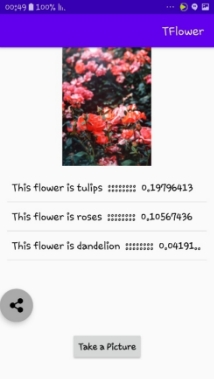 

**Test:** Not a flower				**Test:** Flower not related to category

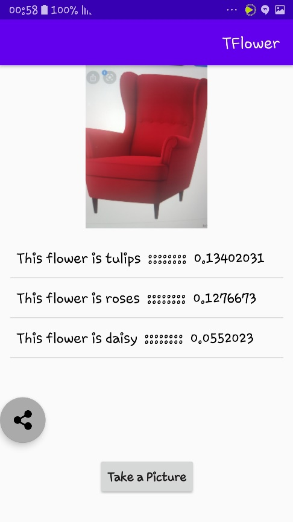**Recognize:** Tulips				**Recognize:** Tulips 

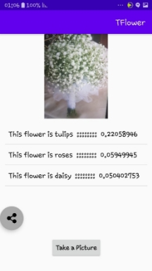

**Test:** Half Flower (daisy)			**Test:** Bouquet of categories flower

**Recognize**: Low				**Recognize**: Medium-Low

**Test:** Black & White (Dandelion)		     **Test:** Field with objects (Tulips)

**Recognize**: High				     **Recognize**: High

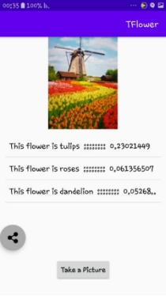 

**Test:** In a sealed vase (Daisy)		     **Test:** In a transferred vase 

**Recognize**: Low				     **Recognize**: High

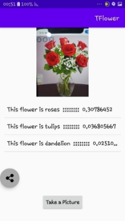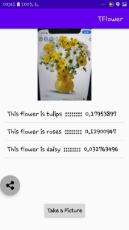

After we finished the Project, we decided to test the model and make some research, we performed the test on a different database. For each category we examined about 50 images. See above the results.

In General, the color of the picture is very significant for the recognizer. 

The prediction of the Dandelion type is infected by the color of the flower, Yellow is High recognize and White is low.  

The Daisy recognition is higher when the picture include stalk. 

Pictures with red color more likely to predict as Rose. 

In case the picture is not a flower or is not from the category – Tulips type is predicted. 

1. # **Workflow**
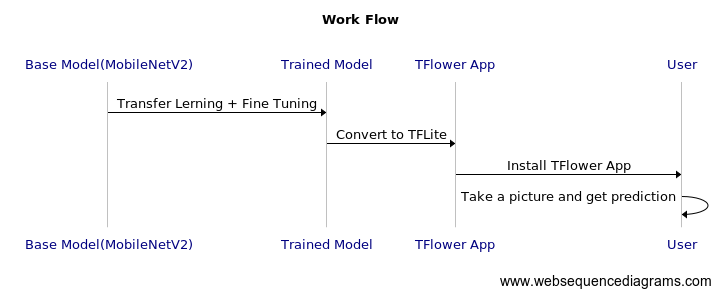

1. # **Bibliography** 
- <https://www.androidauthority.com/best-plant-apps-flower-identification-apps-android-806167/>
- <https://play.google.com/store/apps/details?id=cn.danatech.xingseus&hl=en_US>
- <https://towardsdatascience.com/classifying-flowers-with-transfer-learning-5e17925a1f59>
- <https://medium.com/jovianml/flower-classification-using-transfer-learning-and-cnn-step-by-step-e16c7966305e>
- <https://www.freecodecamp.org/news/how-to-build-the-best-image-classifier-3c72010b3d55/>
- <https://machinelearningmastery.com/how-to-configure-image-data-augmentation-when-training-deep-learning-neural-networks/>

- <https://www.tensorflow.org/lite/convert/python_api>
- <https://stackoverflow.com/questions/17674634/saving-and-reading-bitmaps-images-from-internal-memory-in-android?noredirect=1&lq=1>
- <https://www.kaggle.com/sominwadhwa/flower-recognition-fastai-94-accuracy>
- <https://www.kaggle.com/alxmamaev/flowers-recognition/notebooks>
- <https://www.kaggle.com/vivekvivek13/basic-of-convolution-neural-network-keras>
- <https://www.kaggle.com/delllectron/tensorflow-transfer-learning-flowers-ds>
- <https://www.alibabacloud.com/blog/part-3-image-classification-using-features-extracted-by-transfer-learning-in-keras_595291>
- <https://jjallaire.github.io/deep-learning-with-r-notebooks/notebooks/5.3-using-a-pretrained-convnet.nb.html>
- <https://blog.notyouraveragedev.in/android/image-classification-in-android-using-tensor-flow/>
- <https://www.thepythoncode.com/article/use-transfer-learning-for-image-flower-classification-keras-python>
- <https://www.tensorflow.org/lite/guide/hosted_models#quantized_models>
- <https://www.singularitycoder.com/share-image-and-text-at-once-in-android-example-tutorial/>
- <https://developer.android.com/reference/android/support/v4/content/FileProvider.html#SpecifyFiles>
- <https://www.infopalacess.com/2019/09/share-pictures-from-imageview.html>
- <https://developer.android.com/training/sharing/send>

` `PAGE   \\* MERGEFORMAT 2

